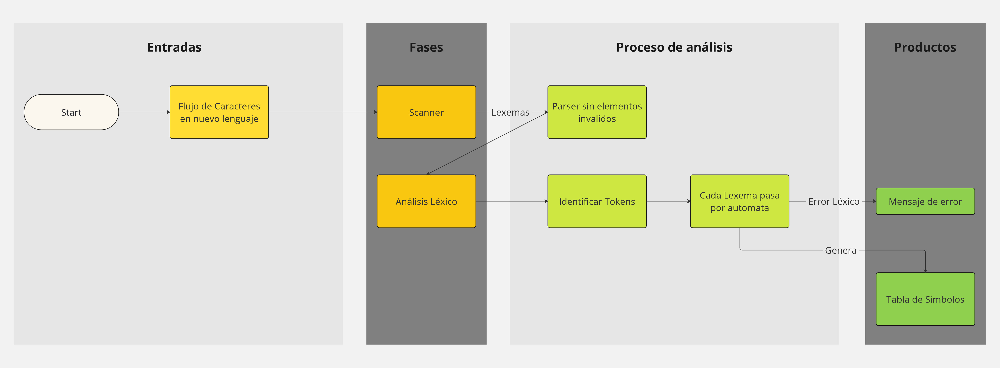

# Claudio

## Resumen
- Transpilador Clarion++ a Clarion (source-to-source) que permite convertir codigo Clarion++; lenaguje que extiende las capcidades de Clarion con una sintaxis mas moderna y expresiva.

## Motivación y Problema a Resolver
- **Descripción del problema:** <br>
  El lenguaje Clarion es anticuado y carese de multiples caracteristicas, consideradas basicas en lenguajes contemporaneos. Dentro de las cuales destaca (pero no se limita a):
    - Solo es posible declarar variables en un segmento de datos definido en el inicio de un procedimiento
    - Es dificil determinar el scope de las variables debido a que Clarion no hace uso de corchetes para delimitar scope
	- No es posible encadenar multiples operadores en una sola linea
	- Clarion no utiliza `;` para determinar el fin de un enunciado, lo cual puede dificultar la lectura del codigo fuente
	

- **Importancia:** 
El lenguaje de Clarion tiene multiples deficiencias, y podria considerarse un "producto de sus tiempos", el cual no se ha modernizado a los estandares actuales. El codigo fuente en Clarion es muy poco expresivo, lo cual resulta en muchas lineas de codigo para realizar tareas comunes, y por consequencia codigo dificil de leer y mantener.
- **Casos de uso:** 

## Objetivos del Proyecto
- **Objetivo 1:**
  - Crear una forma sencilla de utilizar y adaptar código para Clarion.
- **Objetivo 2:**
  - Declaracion de variables en cualquier punto de una funcion.
- **Objetivo 3:**
  - Delimitacion de scope utilizando brackets (`{}`).
- **Objetivo 4**
  - Procesamiento correcto de tokens en el lenguaje

## Revisión del Estado del Arte
- **Compiladores similares:**
TypeScript es un lenguaje de programación de alto nivel, gratuito y de código abierto desarrollado por Microsoft que agrega tipado estático con anotaciones de tipo opcionales a JavaScript. Está diseñado para el desarrollo de aplicaciones grandes y se transpila a JavaScript.

- **Limitaciones de soluciones actuales:**
Al momento de escribir este documento, el unico compilador para codigo fuente Clarion ES el compilador oficial de Top Speed.
- **Justificación del nuevo compilador:**
Clarion es un lenguaje de codigo cerrado, y no hay manera agregar caracteristicas extras al lenguaje en si por medio de un fork o extensiones al compilador. Por lo cual, la unica forma de corregir las carencias del lenugaje señaladas en este documento, es por medio de un transpilador.

## Arquitectura y Diseño del Compilador
- **Diagrama de bloques:**

- **Explicación del flujo de datos:**
- **Decisiones de diseño:**

## Análisis Léxico
- **Análisis léxico:** 
  - Tokenización, identificación de palabras clave, operadores, etc.
- **Ejemplos:**
```
procedure MyProcedure() {
  
  for(int64 i=0; i < 10; i++) {
    MessageBox(i);
  }
}
```

```
function int MyFunction(int a, int b) {
  return a + b;
}
```
```
procedure ComplicatedExpression(string value) {
  functionCall((value == "hello") ? "truthyVal" : "falsyVal")
}
```

## Análisis Sintáctico

- **Análisis sintáctico:** 
  - Uso de gramáticas y árboles sintácticos.

- **Ejemplos:**

## Análisis Semántico

- **Análisis sintáctico:** 
  - Uso de gramáticas y árboles sintácticos.

- **Ejemplos:**

## Pruebas y Validación

- **Metodología de pruebas:**
- **Resultados obtenidos:**
- **Casos de prueba específicos:**

## Herramientas y Entorno de Desarrollo
- **Lenguajes de programación utilizados:**
  - C++ 23
  - Python

- **Herramientas de desarrollo:**
 - CMake
 - vcpkg
 - Visual Studio 2022
 - VSCode

- **Entorno de pruebas y simulación:**

## Demostración
- **Ejemplo de código fuente:**
- **Proceso de compilación:**
- **Ejecución del código compilado:**

## Desafíos y Soluciones
- **Problemas técnicos o de diseño:**
- **Estrategias adoptadas para superar desafíos:**
- **Lecciones aprendidas:**

## Conclusiones y Trabajo Futuro
- **Resumen de objetivos cumplidos:**
- **Evaluación del desempeño:**
- **Propuestas para mejoras futuras:**

## Preguntas y Discusión
- Espacio para responder preguntas y discusión sobre el proyecto.

## Referencias
- **Fuentes citadas:** 
Staff, A. (2012, October 3). Microsoft TypeScript: the JavaScript we need, or a solution looking for a problem? Ars Technica. https://arstechnica.com/information-technology/2012/10/microsoft-typescript-the-javascript-we-need-or-a-solution-looking-for-a-problem/
